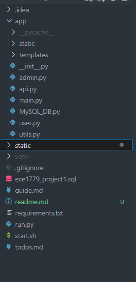
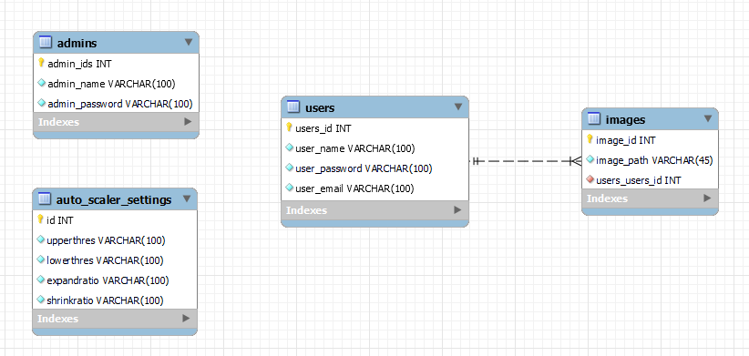
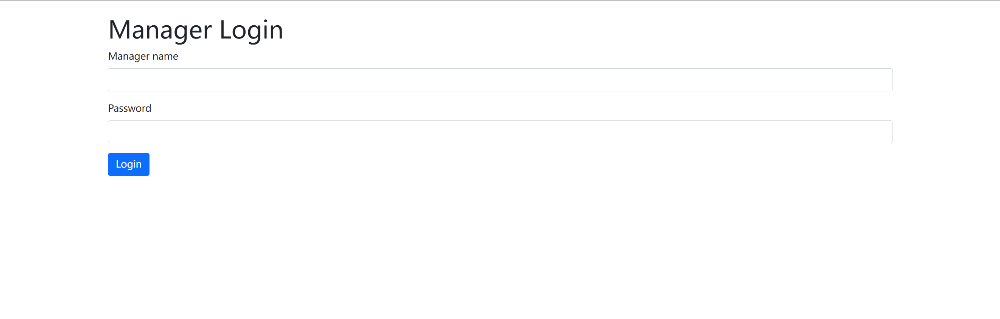
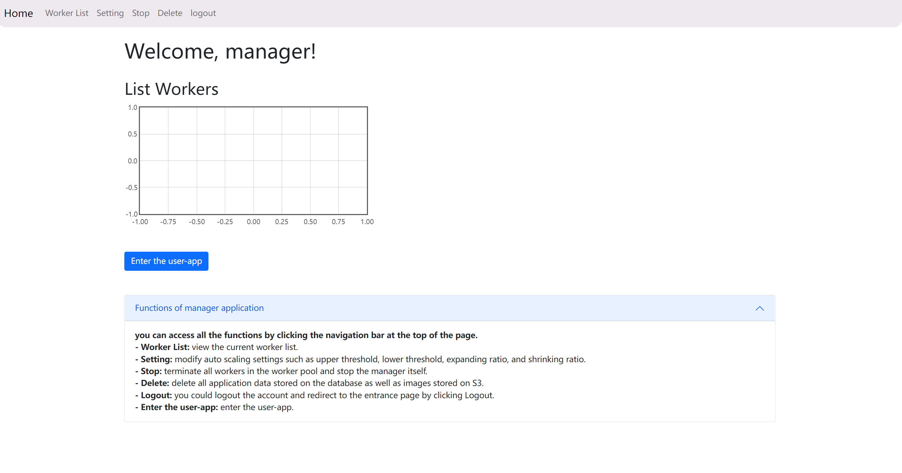
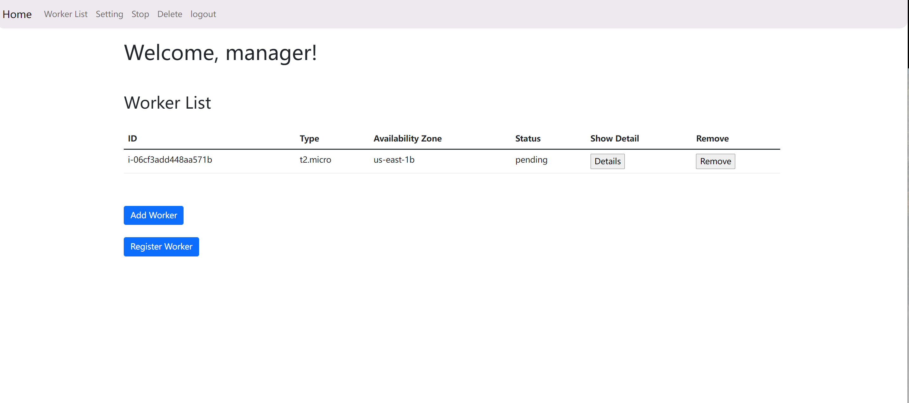
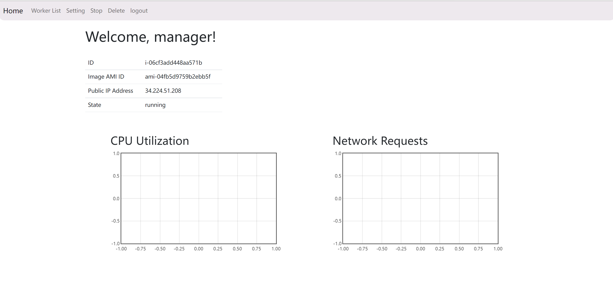
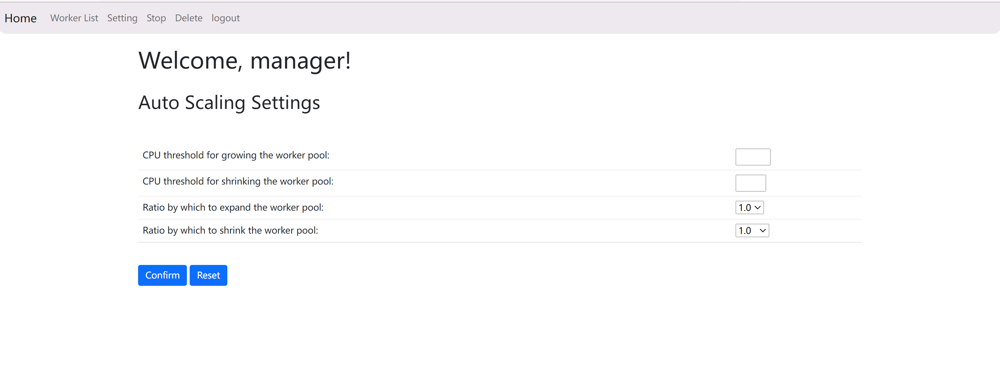
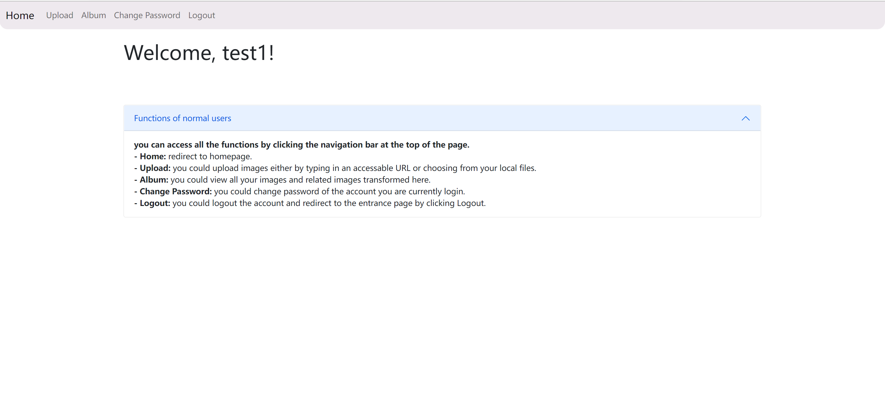
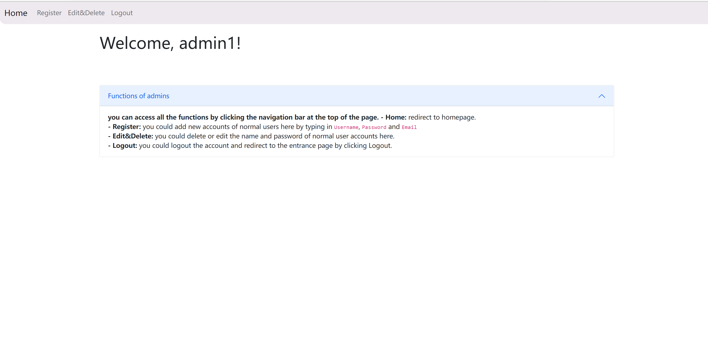
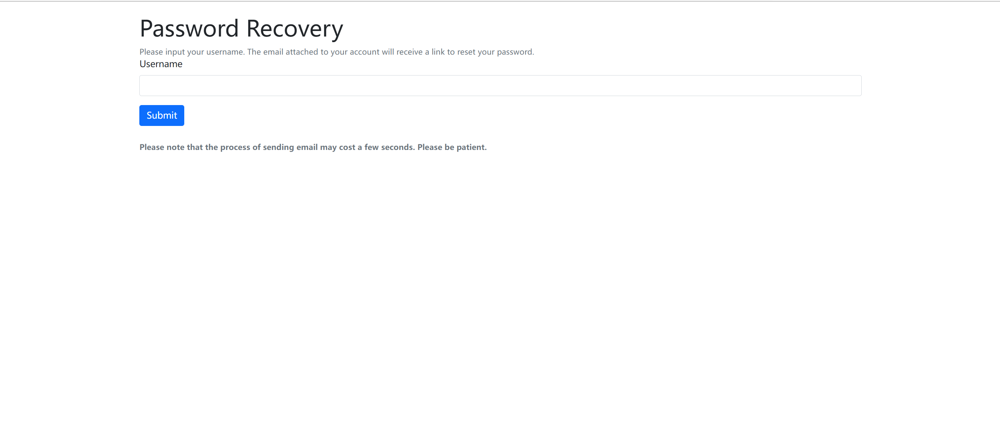

<h1 align="center">Readme of the project1</h1>

---

- [Anouncement](#anouncement)
- [important information for test](#important-information-for-test)
- [Introduction - how to use the web application](#introduction)
  - [Start](#start)
  - [Architecture](#architecture)
  - [Database](#database)
- [ManagerApp Tutorial](#managerapp-tutorial)
  - [Login](#login)
  - [Manager Page](#manager-page)
  - [Worker List](#worker-list)
  - [Worker Details](#worker-details)
  - [Auto Scaling Settings](#auto-scaling-settings)
- [UserApp Tutorial - how to access each module of the application](#userapp-tutorial)

  - [Entrance](#entrance)
  - [Normal User](#normal-user)
  - [Admin](#admin)
  - [Password Recovery](#password-recovery)

- [Tech Stack](#tech-stack)
- [Appendix](#appendix)

<br />

# Anouncement

In this document, we will explain the important parts of our application and introduce how to use it. If there is still anything unclear, please contact us at [lizhenqiao@mail.utoronto.ca](mailto:lizhenqiao@mail.utoronto.ca), we will respond as soon as possible. We will also make an appointment to demonstrate our application as well.

We have accomplished all the functions required for the project, including basic cluster operations, manager functionality, background auto scaling thread, exception handling and so on. Considering that they are not complicated and can be mostly solved by using third-party libraries, this documentation will not go into details of the implementation of them. Besides, we will attach our code anyway.

<!-- <br /> -->

# important information for test

1. credentials and .pem are uploaded in the folder. (Please note that We use root user instead of IAM accounts.)

<!-- <br /> -->

2. Quickstart of the application

   At the **root path**, you are supposed to find a script called \"start\. sh\". This script will establish the virtual environment, prepare you with all the dependencies, and run on the server. Use the command below to run the project.

   ```
   ./start.sh
   ```

<br />

3. Accounts
   Inorder to test the application, you might need some accounts for our application.

   > Manager account: managername: manager, password: ece1779pass

   > Admin Accounts: adminname: admin1, password: admin1

   > User Accounts: None

   - Manager account is a predetermined account, therefore there is no function to sign up a new account or change the account information.
   - You can register User account in the register section of admin page.
   - You can register new admin account by manipulating the TABLE _admins_ in MySQL.

<!-- <br />
<br /> -->

# Introduction

A manager application that applies AWS technologies including: EC2, RDS, S3, CloudWatch, and ELB.

<!-- <br /> -->

## Start

> This part basically explains how to run the project.

- ### Quickstart

  At the **root path**, you are supposed to find a script called \"start\. sh\". This script will establish the virtual environment, prepare you with all the dependencies, and run on the server. Use the command below to run the project.
  <!-- <br /> -->

  ```
   ./start.sh
  ```

  <!-- <br /> -->

<!-- <br />
<br /> -->

## Architecture

For web frameworks, we use `Flask` as our application. Right now, we are using templates for the UI part since it is relatively simple to accomplish. Since most of our data is structured, we tend to use MySQL as the RDS base for better performance and easier modification.

<!-- <br /> -->

<div style="display: flex; justify-content: flex-start">
  <div>
    </img>
  </div>
  <div style="margin-left: 30px; width: 400px">
    The architechture of our version1.0 project basically looks like this. We have a app folder which contains main content of our flask app. We divided this folder by the functions of each part as admin, user and so on. Except for app folder, we have several files related to version control and project co-working, and a file related to code-format-checking.
  </div>
</div>
<!-- <br />
<br /> -->

## Database

Our database is based on MySQL which could deal with the syntactic reading and writing. Generally, we are continuing using the database structure from the assignment 1, the only change is that we have added a new table for the auto scaling settings.

- _admins_ stores the related information of admin users, mainly for login and verification of identity.
- _users_ stores the related message of normal users, it is important for the main functions of our application.
- _images_ stores the user_id and image_path, which is the core of our image storage system.
- _Auto_scaler_settings_ stores only one row of data. This table does not need to take any inserted data, it only accepts updates of the one row data of auto scaler settings.
  </img>

# ManagerApp Tutorial

## Login

**Manager Login** is the first page you will see. It is basically the entrance of manager app.
</img>

## Manager Page

After login as the manager, you will see the homepage of the manager app as shown in the picture below.
</img>
You can access all the functions by clicking the navigation bar at the top of the page.

- **View worker list**: you could view the current worker list in a table.
- **Enter the user-app**: you could enter the user-app, which is the assignment 1 part by this load-balancer DNS name.
- **Edit auto scaling settings**: you could modify all four auto scaling settings such as upper threshold, lower threshold, expanding ratio, and shrinking ratio.
- **Stop the manager**: you could terminate all workers in the worker pool and stop the manager itself.
- **Deleting all application data**: you could delete all application data stored on the database as well as images stored on S3.

## Worker List

After you enter the worker list page, you will see a table which contains all workers inside as shown in the picture below.
</img>

- **Add worker & Register worker**: you are able to manually add a worker into the pool and register them to the load balancer on the top left of the table.
- **View details & Terminate**: you have the option to view details of each existing worker or terminate it.

## Worker Details

After you enter the detail page of each worker, you will see a table of details of a specific worker and two charts of the worker as shown in the picture below.
</img>

- **Worker details table**: you could see details of a specific worker such as instance id, availability zone, and so on.
- **Worker details chart**: you could see two charts of the worker which are the total CPU utilization chart and the rate of received HTTP requests chart.

## Auto Scaling Settings

After you enter the auto scaling settings page, you will see a form with 4 change options as shown in the picture below.
</img>
**The default values of the four variables are 100, 0, 1 and 1.**

- **Upper threshold**: you could manually input an integer value which is equal or greater than 50 and equal or smaller than 100. This field is required.
- **Lower threshold**: you could manually input an integer value which is equal or greater than 0 and equal or smaller than 50. This field is required.
- **Expanding ratio**: you could select a ratio from the two options: 1.5 (expand the worker pool by 1.5 times current workers count) and 2 (expand the worker pool by 2 times current workers count).
- **Shrinking ratio**: you could select a ratio from the two options: 0.75 (shrink the worker pool by 0.75 times current workers count) and 0.5 (shrink the worker pool by 0.5 times current workers count).

# UserApp Tutorial

## 1.Entrance

**Entrance page** is the first page you will see. There is a readme which explains the functions of the three part right in the webpage.
</img>

- **User Login** <br />
<strong>User login is the entrance of normal users.</strong><br />
You would be asked to input your username and password to login.<br />
After login, you can access all the functions by clicking the navigation bar at the top of the page. <br />
<strong>- Upload:</strong> you could upload images either by typing in an accessable URL or choosing from your local files. <br />
<strong>- Album:</strong> you could view all your images and related images transformed here.<br />
<strong>- Change Password:</strong> you could change password of the account you are currently login. <br />
<strong>- Logout:</strong> you could logout the account and redirect to the entrance page by clicking Logout. <br />
<!-- <br /> -->

- **Admin Login**<br />
<strong>Admin login is the entrance of admins.</strong><br />
You would be asked to input the username and password to login.<br />
After login, you can access all the functions by clicking the navigation bar at the top of the page. <br />
<strong>- Register:</strong> you could add new accounts of normal users here by typing in <code>Username</code>, <code>Password</code> and <code>Email</code><br />
<strong>- Edit&Delete:</strong> you could delete or edit the name and password of normal user accounts here. <br />
<strong>- Logout:</strong> you could logout the account and redirect to the entrance page by clicking Logout. <br />
<!-- <br /> -->

- **Password Recovery**<br />
  <strong>If you cannot recall your password, please click <code>PasswordRecovery</code></strong>
  You would be asked to input the username of your account. An email will be sent to the email address attached to your account for you to reset the password.

## 2. Normal User

After login as normal user, you would see the homepage of normal user shown as the picture below.

</img>

<strong>you can access all the functions by clicking the navigation bar at the top of the page.</strong><br />
<strong>- Home:</strong> redirect to homepage. <br />
<strong>- Upload:</strong> you could upload images either by typing in an accessable URL or choosing from your local files. <br />
<strong>- Album:</strong> you could view all your images and related images transformed here.<br />
<strong>- Change Password:</strong> you could change password of the account you are currently login. <br />
<strong>- Logout:</strong> you could logout the account and redirect to the entrance page by clicking Logout.<br />

<!-- <br /> -->

## 3. Admin

After login as admin, you would see the homepage of admin shown as the picture below.

</img>

<strong>you can access all the functions by clicking the navigation bar at
the top of the page.</strong><br />
<strong>- Home:</strong> redirect to homepage.<br />
<strong>- Register:</strong> you could add new accounts of normal users here by typing in <code>Username</code>, <code>Password</code> and <code>Email</code><br />
<strong>- Edit&Delete:</strong> you could delete or edit the name and password of normal user accounts here.<br />
<strong>- Logout:</strong> you could logout the account and redirect to the entrance page by clicking Logout. <br />

<!-- <br /> -->

## 4. Password Recovery

<strong>If you cannot recall your password, please click <code>PasswordRecovery</code></strong>
You would be asked to input the username of your account. An email will be sent to the email address attached to your account for you to reset the password.
</img>

## Tech Stack

**Version 1.0**

- python
- flask
- mysql

> You could see the details of all the dependencies at "requirements.txt"

## Appendix

- [Flask](https://flask.palletsprojects.com/en/2.0.x/)
- [python](https://www.python.org/)
- [React.js](https://reactjs.org/)
- [pre-commit](https://pre-commit.com/)
- [flask-mail](https://pythonhosted.org/Flask-Mail/)
- [bcrypt](https://pypi.org/project/bcrypt/)
- [imagemagick](https://imagemagick.org/index.php)
- [boto3](https://boto3.amazonaws.com/v1/documentation/api/latest/guide/quickstart.html)
